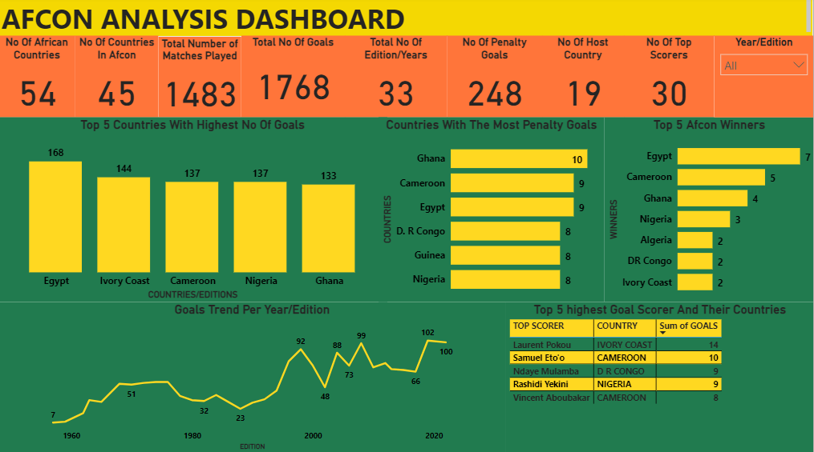

# AFCON Analysis Over The Years

## Introduction
This Dataset is about  The Africa Cup of Nations (AFCON), which is the main international men's football championship of Africa organized by the Confederation of African Football (CAF).I Embarked on an exploration of the AFCON data to see through the rich tapestry of the tournament's history. Beyond the mere statistics lie untold narratives waiting to be unearthed, revealing the essence of what makes AFCON a cherished spectacle in the world of football. 
From tracking the evolution of goal-scoring trends to identifying the most dominant teams, each insight unveils another chapter of the tournament’s legacy, revealing its impact on players, fans, and the entire African continent.

## PowerBi Concept Applied;
  1. Power Query Editor
  2. Data Modelling: Stat Schema

## Problem Statement
1. How has the total number of goals scored in Afcon tournaments evolved over the years?
2. Which countries have produced the most top scorers?
3. Which players have the highest contribution to their team's goals in Afcon history?
4. Are there any trends or patterns in penalty goals across different Afcon Countries?
5. Which countries have the most win in Afcon history?
   
## Data Sourcing
This data from my data challenge group Datafrik on twitter. The dataset is in Excel workbook format, encompassing multiple sheets, each presenting distinct AFCON information: Goals By Year and Country, AFCON By Country, Top Goal Scorer, Number of Games, Number of Hatricks By Year, Number of Penalties By Year, AFCON’s Own Goal, etc.

## Data Cleaning/Transformation
I used power query editor in PowerBi for the cleaning and transformation, These are the steps taken;
1. I removed null values with Zero (0)
2. I made some of the tables first row the header
3. Then I unpivot the tables
4. Change data type From 'Text' to 'Whole Number'

## Data Modelling
PowerBi automatically connected some the related tables resulting in a star schema model. The AFCON Goals by Year and Countries is the fact table of the model,  AFCON By Country, Top Goal Scorer, Number of Games, Number of Hatricks By Year, Number of Penalties By Year, AFCON’s Own Goal are the dimenision table they are connected by the common colunn; Countries Column and Year/Edition column. I connected the remain two countries that where not connect; the AFCON by country and the AFCON podium finish.

## Data Analysis And Visualization

1. With 45 out of 54 African countries participating in Afcon, it indicates significant representation across the continent. The 1483 matches played over the past 33 years demonstrate the tournament's longevity and the frequency of football matches.
2. The total of 1768 goals scored highlights the excitement and competitiveness of Afcon matches. The presence of 248 penalty goals indicates the importance of set-piece situations in influencing match outcomes.
3. Egypt, Ivory Coast, Cameroon, Nigeria, and Ghana emerging as the countries with the highest number of goals underscores their footballing prowess and consistency in Afcon tournaments. The record-breaking 102 goals in 2019 signifies an exceptionally high-scoring tournament.
4. The concentration of penalty goals among Ghana, Cameroon, Egypt, D R Congo, Guinea, and Nigeria emphasizes the significance of penalty-taking proficiency and its impact on match results.
5. The top five goal scorers, including Laurent Pokou, Samuel Eto'o, Ndaye Mulamba, Rashidi Yekini, and Vincent Aboubakar, represent some of the most prolific and influential players in Afcon history, contributing significantly to their national teams' success.
6. Egypt's dominance with seven Afcon titles, followed by Cameroon with five, Ghana with four, and Nigeria with three, reflects the historical success and competitive spirit of these nations in African football.

## Conclusion And Recommendation
1. More African countries should be encourge to participate in Afcon by promoting grassroots football development and providing support for smaller federations.
2. Teams should focus on penalty-taking training to improve their conversion rate during critical moments in matches, potentially impacting match outcomes.
3. To ensure a brighter future for African football, let's focus on investing in youth development programs across the continent. By nurturing young talent, we can create a sustainable pipeline of skilled footballers who will represent their nations with pride in future AFCON tournaments.
4. Encouraging fair play and sportsmanship can help foster a positive and inclusive environment for all teams, while also minimizing penalties and ensuring equal opportunities for success.
5. It is imperative to invest in youth development initiatives to nurture talent and groom future top scorers, thus ensuring a sustainable pipeline of skilled players for African football.

In conclusion, the insights gleaned from the analysis of Afcon data provide valuable information on the tournament's history, trends, and key contributors. The data underscores the significance of goals, penalty goals, top scorers, and tournament winners in shaping the landscape of African football. By implementing the recommended strategies, stakeholders can continue to elevate the quality and competitiveness of Afcon, contributing to the growth and development of football across the continent.
